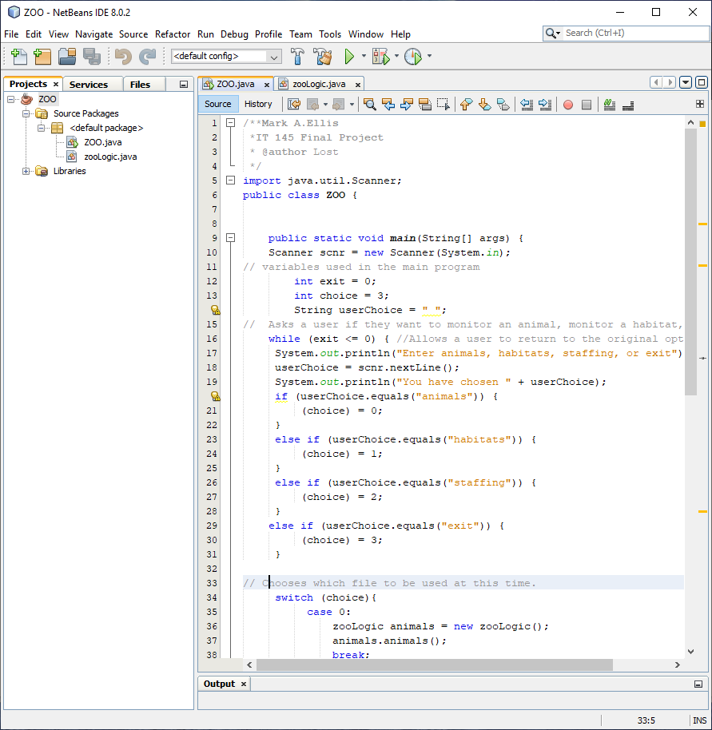
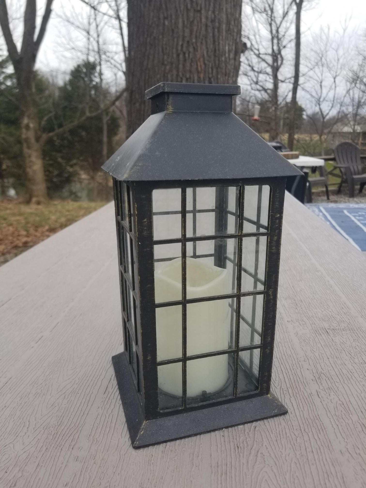
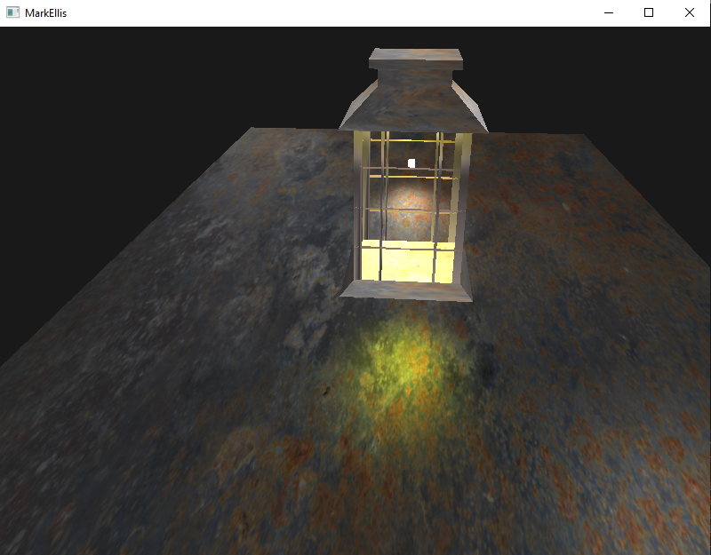
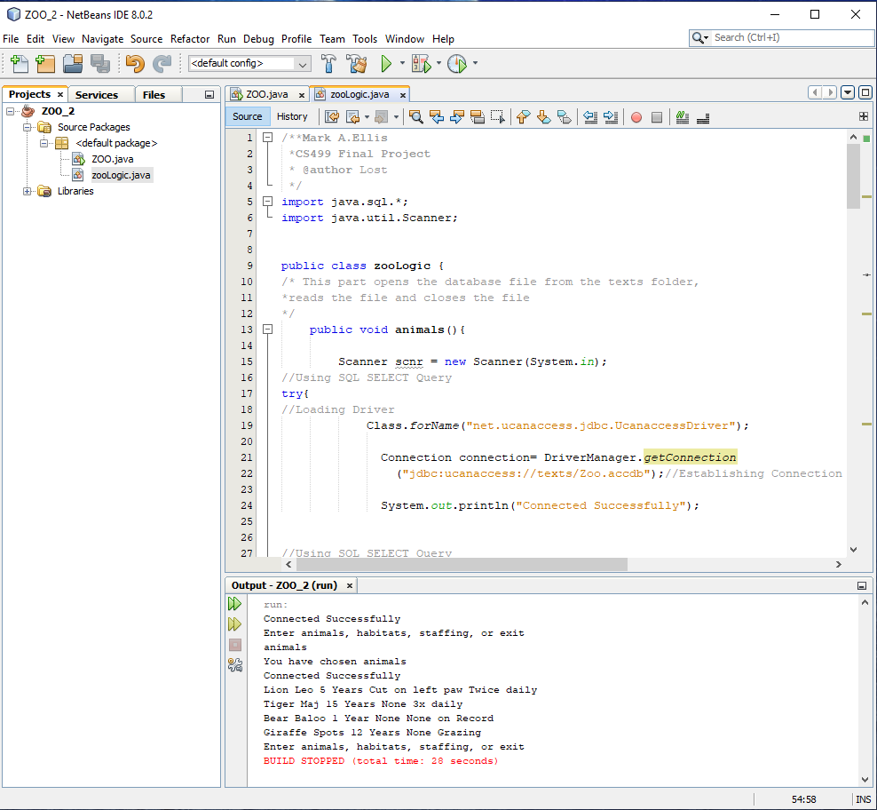

## About Me

   I am a college student in my final year for my Bachelor of Computer Science. I have spent 5 years working towards this goal at night and on weekends while holding full time positions at various companies. I have started on my journey to computer science early on. I first started to code in hexadecimal on a Texas Instrument with a cassette tape backup. It took me three days of coding to get an eight-bite character to move up and down on the TV screen. I then moved onto writing my own batch files in DOS. I was working in IT before IT was a thing. I have been working for the past 23 years on 911 consoles with databases of the officers and fire departments pagers. I have made custom icons for the computer screen consoles. I have also worked on ethernet for radio connectivity around a whole county. I have incorporated the three agencies onto one channel by time domain multiplexing and then splitting the audio back out when back at the main site. I have seen and worked many programs and software platforms that are specialized for different pieces of equipment as well as creating special cables to connect the different pieces of equipment together that normally do not work together.

   Below are just a few samples of my work and my capabilities that I have learned as being enrolled in the Computer Science Degree. I have choose to show one of my first class work from 2016 and moving on till completion in 2021.


## **Algorithms and Data Structures**



```markdown
   This artifact is a Java program written in Java. This is a
program that is written to open and read a text file to find
key words and display what is tied to the word and close the
file. This was created on 2016-12-22. This is a good simple
program that shows Object-oriented Programming. I selected 
this artifact because I had fun making this object. The 
specific component of the artifact that I wanted to show case
is the algorithms. This program asks which file you want to
open. Next it opens the file and ask what you want to look
at. After you are done reading this file it closes the open 
document. This program also steps through a search by reading
and asking questions to see what you are looking for. This
program could be modified easily to use a different file type
or different words.
```
[Zoo Repository](ZOO3.zip)

[Zoo Review](IT145review.mp4)


## **Software Engineering/Design**





```markdown
   This artifact is an OpenGL program created in C++. We took
a collection of boxes and turn it into something else with
three basic shapes. I have taken one box and changed it into
a table that is a shape of a plane, and a lantern which was a
lot of shapes of cubes and pyramids. This was created on
2021-03-11. I selected this artifact because I had fun making
this object. The specific component of the artifact that I
wanted to show case is my ability to see the creation of an
object in a set of points. I was able to see the points to
make the triangles to make a particular object. The first
image is the lantern and table in my yard. The second image
is the recreation of that object in this programming
environment. The scene is set at night to give the
illustration of the different lighting.
```
[Lantern Repository](Lantern.zip )

[Lantern Review](LanternReview.mp4)


## **Databases**



```markdown
  This artifact is a Java program written in Java. This is a 
program that is written to open and read a text file to find
key words and display what is tied to the word and close the
file. This was created on 2016-12-22. This is a good simple
program that shows Object-oriented Programming. I have
chosen this program to show my capability to change from one
type of file structure to another. I am leaving the first 
part of this code almost the same. I added a section to make
sure you were connected to the database before you start to
ask questions to it. Most of the work is done outside of the
main program in the classes for each of the tables. In the
old program it was reading from three different txt files. 
Now it is reading from three tables in one database file. 
This Database was created in Microsoft Access.
```
[Zoo Redo Repository](Zoo2.zip)

[Zoo2 Review](Zoo2.mp4)


For more details see [GitHub Flavored Markdown](https://guides.github.com/features/mastering-markdown/).

### Jekyll Themes

Your Pages site will use the layout and styles from the Jekyll theme you have selected in your [repository settings](https://github.com/ShadowDweller205/CS499/settings/pages). The name of this theme is saved in the Jekyll `_config.yml` configuration file.

### Support or Contact

Having trouble with Pages? Check out our [documentation](https://docs.github.com/categories/github-pages-basics/) or [contact support](https://support.github.com/contact) and we’ll help you sort it out.
